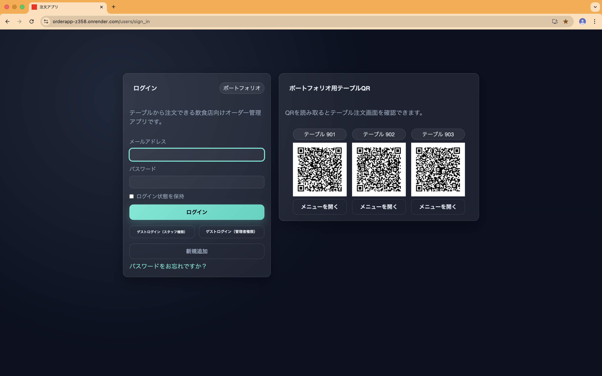
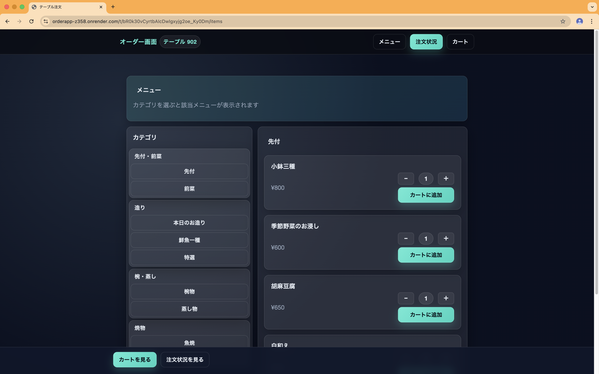
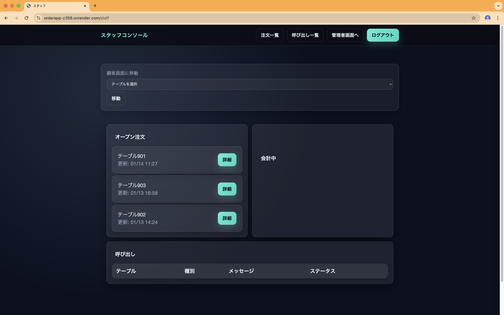
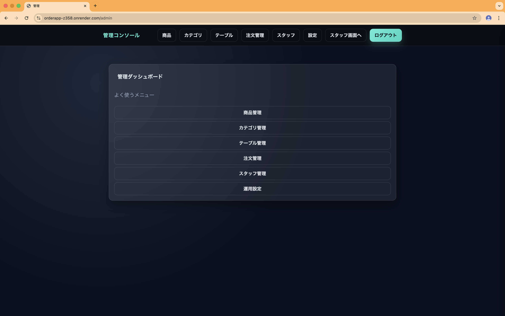
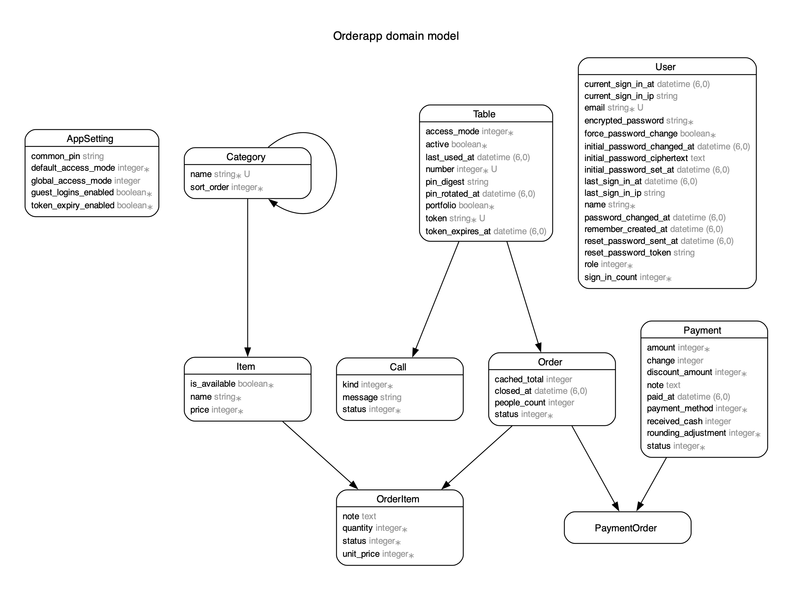

# Orderapp（ポートフォリオ）

飲食店向けの **テーブル注文・スタッフ管理システム** を想定して開発したポートフォリオアプリです。
来店客はスマートフォンからQRコードを読み取り注文を行い、スタッフ・管理者は専用の管理画面から注文状況や店舗設定を管理できます。

---

## Demo / Usage

- ログイン画面に **ポートフォリオ用QRコード（3テーブル分）** を表示しています。
- QRを読み取ることで、テーブル注文画面へ直接アクセスできます。
- 実際の店舗運用を想定し、「客側画面」「スタッフ画面」「管理画面」を明確に分離しています。

---

## アプリの使い方

1. ログイン画面にあるQRコードを読み取る（客側画面に遷移）。
2. メニューから商品を選び、数量を指定して注文を送信。
3. スタッフ/管理者は管理画面にログインし、注文状況やテーブル状態を確認・操作。

---

## スクリーンショット






---

## Main Features

### 客側（テーブル注文）
- QRコードからの注文画面アクセス
- メニュー閲覧・数量指定・カート操作
- 注文送信・呼び出し機能

### スタッフ向け
- 注文一覧・呼び出し一覧の確認
- 会計対応
- テーブル状況の把握

### 管理者向け
- 商品・カテゴリ管理
- テーブル管理（QR生成・有効/無効切替）
- 注文履歴管理
- スタッフ管理
- 運用設定（ゲストログイン可否など）

---

## Tech Stack

- Ruby on Rails 7
- PostgreSQL
- Hotwire（Turbo / Turbo Streams）
- RQRCode（QRコード生成）
- Render（デプロイ）

---

## ER図



---

## なぜこれを作ったのか

飲食店の注文業務はピーク時の負荷が高く、スタッフの対応に時間が取られがちです。  
このアプリでは「QRによるセルフオーダー」と「スタッフの管理動線」を分離し、現場の負担を減らしつつ注文状況をリアルタイムに把握できる体験を目指しました。  
また、Rails標準構成のHotwireでどこまで即時性のあるUIを実現できるかを検証する目的もあります。

---

## Architecture / Design Notes

- **Hotwire（Turbo）を活用**し、SPAに近い操作感をRails標準構成で実現
- フルリロードを避け、注文・数量変更・管理操作は Turbo Stream を中心に実装
- 権限設計を意識し、「管理者 / スタッフ / ゲスト（顧客）」の役割を分離
- ポートフォリオ用途を考慮し、ゲストログインやQR即時体験が可能な構成にしています

---

## Setup（Local）

```bash
bundle install
bin/rails db:create db:migrate db:seed
bin/rails s
```

---

## Environment Variables
### 必須:
- `RAILS_ENV`
- `RAILS_MASTER_KEY` (production用)
- `PGHOST`
- `PGPORT`
- `PGUSER`
- `PGPASSWORD`
- `PGDATABASE`
- `INITIAL_PASSWORD_ENCRYPTION_KEY` (未設定の場合はcredentials側に設定)

### seed初期ユーザー:
- `INITIAL_ADMIN_PASSWORD`
- `INITIAL_CHIEF_PASSWORD`

---

## Portfolio Notes
- 本アプリは**ポートフォリオ用途**で作成しています。
- ポートフォリオ用テーブルは以下の3件を用意しています。
  - 901 / 902 / 903
- QRコードから、実際の注文フローを確認できます。

---

## Deployment (Render)
- URL：https://orderapp-z358.onrender.com/
- Render の無料枠を使用しているため、初回アクセス時は起動に時間がかかる場合があります。

---
